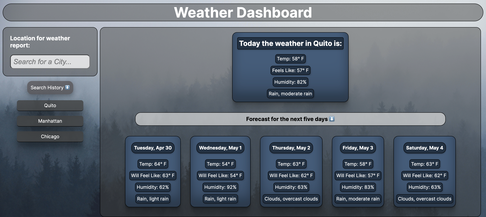

# Weather Dashboard

[live site](https://anton-oz.github.io/Weather-Dashboard/)

## Description

I built this app because I wanted to search for a city around the world and then display the weather/forecast for that city on an aesthetically pleasing webpage. I used the openweather api so that the website always shows the most up to date weather information for the selected location. I found that javascript is extremely powerful when it comes to dynamically generating a website, especially when the content being displayed changes on user input. 

The bgImages folder in assets will eventually be used to change the site background image based on the currently selected cities weather.

## Installation

N/A

## Usage

To use the website, type a city name into the search bar and press enter. The weather data for that city will be fetched and displayed on the webpage. Then type another city name into the input, or click a city in your search history to go back to a previous search.

## Credits

[input focus styling](https://stackoverflow.com/questions/17324960/copy-chrome-default-inputs-outline-style)

[box shadow styling](https://getcssscan.com/css-box-shadow-examples?ref=beautifulbuttons-bottom)

[card color palette](https://palettes.shecodes.io/palettes/267)

[down arrow emoji](https://emojipedia.org/down-arrow)

## License

N/A
